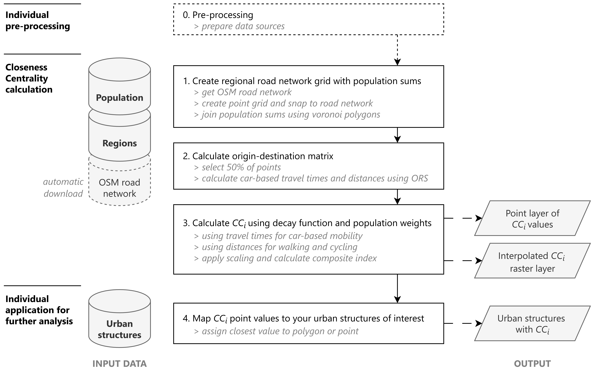
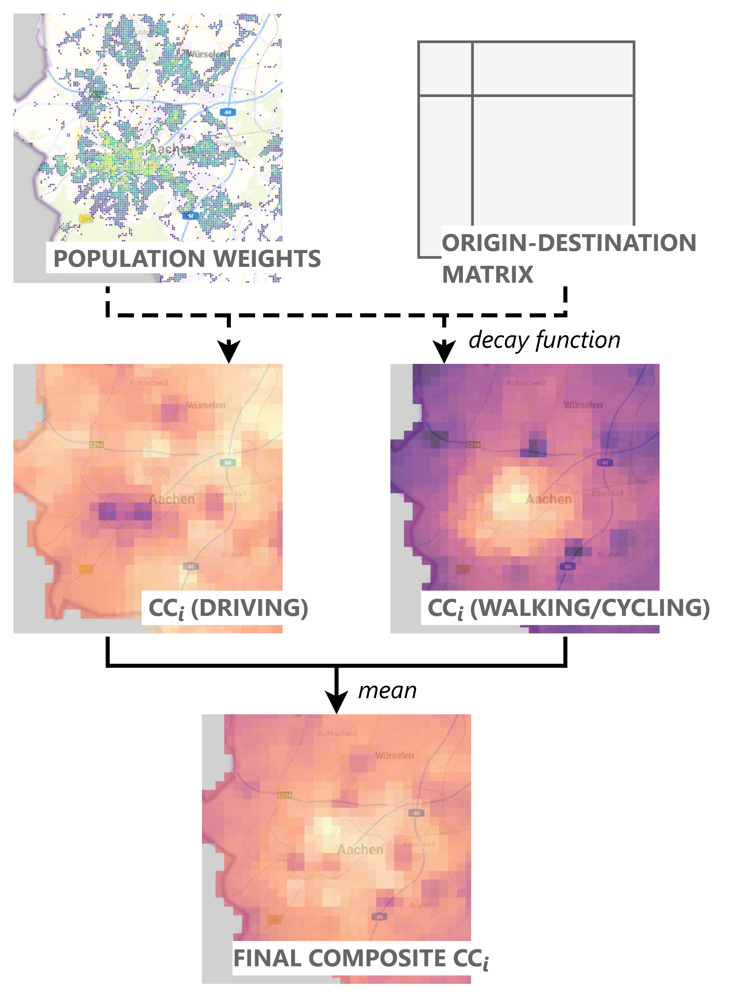

# Measuring regional accessibility in urban form: A reproducible approach for urban analytics

This repository provides an approach to calculate a centrality measure that describes the accessibility of urban structures in relation to all other inhabited places in a functional region. This is helpful to describe locations in the polycentric urban form of contemporary functional urban regions.
We apply a network-based approach to the regional road network and calculate closeness centrality (CC) [Jain & Jehling (2023)](https://doi.org/10.1016/j.jtrangeo.2020.102781), where every location is described through the weighted travel time and distance to other locations on the road network using OpenRouteService (ORS, openrouteservice.org by HeiGIT). 
To capture urban-rural mobility behaviour as well as urban short-distance travelling, a combined centrality measure is calculated through applying impedance functions by mode of transport. 
The approach is designed to focus on an urban center and its surrounding area determined by an input geometry and a buffer distance set around it.

## Workflow

#

Based on a regional road network taken from OpenStreetMap (OSM), a grid of points in an area of interest and a selected buffer around this zone is created. Each point is assigned a population value using a census grid.
Using ORS, the travel time (h) and distance (km) between all points is extracted as a basis for applying an impedance function to derive centrality values for locations.
For this, urban-rural commuting is represented using driving time by car, whereas inner-urban mobility is included through combining cycling and pedestrian impedance behaviour based on distance values. 
A power exponential decay function is used for both types and the parameter values are chosen based on values determined per travel mode following Verma & Ukkusuri [(2025)](https://doi.org/10.1016/j.jtrangeo.2024.104061).
After applying the impedance function, the mean of the bike and pedestrian value as well as the car value are weighted according to the population of the destination points. 
The values are then summarised to obtain the decay-weighted total reachable population per point.
We standardise both values to avoid outlier-distortion and crop the points to the original area of interest (excluding the buffer).
Lastly, the centrality values for the two modes of driving by car and walking/cycling are normalised to a scale of 0-1 and finally averaged into a composite index. 

Now, the points, still representing a grid along the street network, can be mapped to the objects of the urban structures of interest using their closest point. This can be single buildings or similar structures like building blocks or vacant lots, which serves as the example. 

Additional, it is possible to create an interpolated raster layer between the destination point. This is helpful for visualisation of the CC gradient within the whole region.

The script also offers the possibility of merging individual region results together. This can be helpful for further analysis.

## Output

The output of the process is a geographic data set of urban structures with three different CC measures (`CC_mean`, `CC_mean_car`, `CC_mean_shortdist`) . This accessibility value ranges between 0 and 1 with higher values representing a 
higher centrality based on reachable population and good transport connections. As intermediate output the same CC measures are available on a regular point grid. Optionally, the output includes an interpolated raster of the point grid.
All outputs are saved individually per region and optionally merged for all regions.

## Getting started

The purpose of this repository is to provide the code for documentation of the approach and for providing a workflow for further applications. 
Information on the data used in the provided code will be given but reproducing it with the exact data used in the example is not the main aim of this repository. 

### Input data

The process uses several data sources. More information on input data is provided in [data_input.md](data_input.md).
Place the input files into a sub folder of your project folder `input`.

### Prerequisites

The workflow uses [Python](https://www.python.org/), [QGIS](https://qgis.org/) and [R](https://www.r-project.org/).
Further, an API and a local instance of [OpenRouteService](https://openrouteservice.org/) is needed.
Further details on the software used can be found in [software_used.md](software_used.md).

Before running: 

* ORS:
  * Set up your own OpenRouteService instance. See details here: https://giscience.github.io/openrouteservice/run-instance/
  * Install ORSTools QGIS Plugin: https://github.com/GIScience/orstools-qgis-plugin
  * Set your local instance as provider for the plugin
* QuickOSM:
  * Install QuickOSM QGIS Plugin: https://quickosm.github.io/QuickOSM/

### Description of the code

The process includes these main steps: 

0. Pre-processing
1. Road network points with population values per region
2. Computation of travel-time/distance between each origin and all destinations for each region
3. Application of impedance functions and population weighting, normalisation and mapping to polygon shape structures

The file [A_workflow.Rmd](code/A_workflow.Rmd) gives an overview on the processing steps and describes them in detail. Processing steps can be run directly form the workflow script or have to be executed separately in QGIS, as explained in the workflow at the respective location.

The code is taken from an application of the approach to vacant lots in four regions in Germany. One of them is the region of Aachen (Planungsregion Aachen), which is provided as test data.

### Additional Approaches and Applications

We also applied the approach for an area of interest with two neighbouring urban centres with some degree of interaction of their functional regions. While these centres have different centralities in terms of absolute reachable population they have a similar role as urban centers for their specific regions. 
We found running the workflow for each region separately and choosing the maximum value in overlapping areas to be a successful approach to handle this.

If census data is not available, the [Global Human Settlement (GHS) population](https://human-settlement.emergency.copernicus.eu/download.php?ds=pop) raster layer has been used to provide population data in several projects. 

